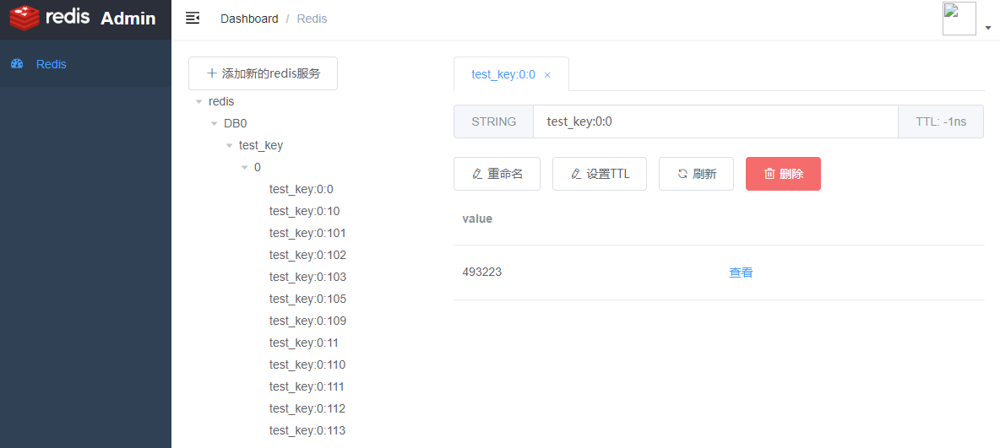

## Redis Admin

Open source Redis Web Manager based on golang & vue.



## Getting started
```shell
docker run -d -v /usr/share/redis-admin/data:/usr/share/redis-admin/data -p 6789:6789 ikaven123/redis-admin
```

Then visit http://localhost:6789 on browser.

## Build

Use golang >= 12.0, node >= v8.11.1

```shell
# build server
cd serv && go run .

# build web
cd web && npm run dev
```

## Release

```shell
make
```

## Thanks

1. [PanJiaChen/vue-element-admin](https://github.com/PanJiaChen/vue-element-admin)

